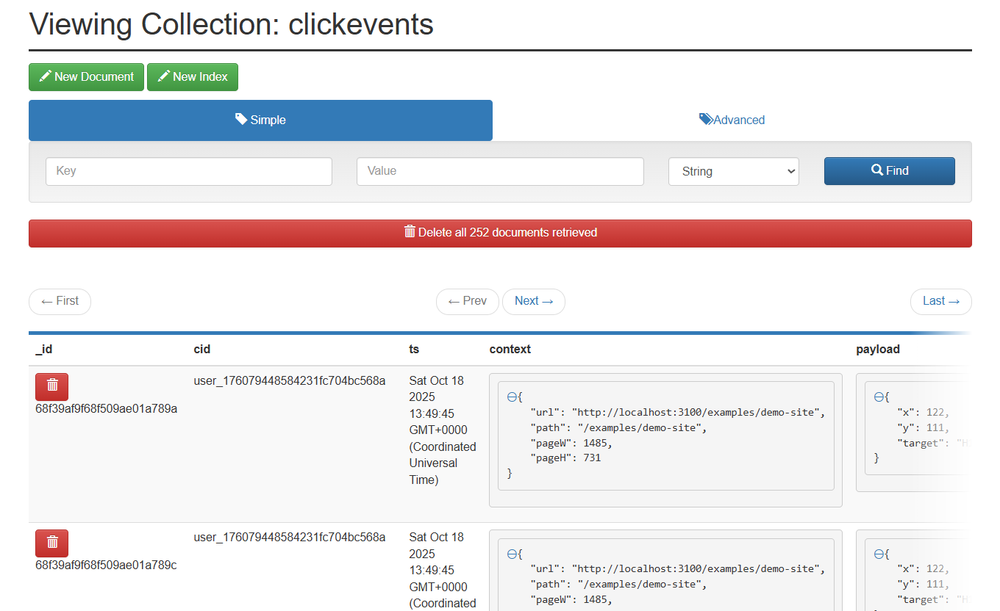

# SitePulse: Real-Time Website Analytics & Heatmap Tracker

Engineered a distributed analytics system to ingest, process, and visualize high-volume website user events in real-time. This 12-service application uses a Kafka pipeline, Node.js, and MongoDB to power a live React dashboard and click heatmap, all monitored by Prometheus and Grafana.

A preview of the real-time analytics dashboard.

## Key Features

Real-Time User Count: See how many users are active on your site right now, with a 2-second refresh rate.

Live Click Heatmap: Visualize where users are clicking in real-time on a screenshot of your website.

Top Pages: Track which pages are most viewed by your active users.

High-Throughput Ingestion: Capable of handling over 1,500 events/second via a non-blocking tracking snippet.

Persistent Storage: All click and page view data is saved in MongoDB for historical analysis.

Full Observability: A complete monitoring and alerting stack using Prometheus, Grafana, and Alertmanager.

Containerized: The entire application is orchestrated with Docker Compose for easy setup and development.

## System Architecture

The application is built on a microservices architecture, using Kafka as a message broker to decouple services and handle high data volumes.

```
+----------------------+        +----------------+        +-------------------+
|  Instrumented Site   |  --->  |  Tracking API  |  --->  |    Kafka Cluster  |
|  (snippet.js)        |  HTTP  |  (Producer)    |        |  (user-events)    |
+----------------------+        +----------------+        +-------------------+
                                            |                       |
            +-------------------------------+-----------------------+
            |                                                       |
            v                                                       v
+-----------------------+      +-----------------------+      +---------------------+
|  Analytics Processor  | ---> |       MongoDB         |      | Socket.io Broadcaster |
| (Consumer & Producer) |      | (Historical Storage)  |      |     (Consumer)      |
+-----------------------+      +-----------------------+      +---------------------+
            |                                                       |
            +-------------------------> Redis <----------------------+
                  (Session Management)                              |
                                                                    v
                                                          +-----------------------+
                                                          | React Admin Dashboard |
                                                          | (Socket.io Client)    |
                                                          +-----------------------+

```

Monitoring Stack:
Prometheus scrapes metrics from all Node.js services. Grafana visualizes this data. Alertmanager handles alerts.

## Technology Stack

### Category

#### Technologies

#### Frontend

React.js, Socket.io Client, HTML5 Canvas

#### Backend Services

Node.js, Express.js, Socket.io Server

#### Data Pipeline

Apache Kafka, Zookeeper

#### Database / Cache

MongoDB, Redis

#### Infrastructure

Docker, Docker Compose

#### Observability

Prometheus, Grafana, Alertmanager

#### Language

JavaScript (Node.js)

## Getting Started

### Prerequisites

Docker Desktop installed and running.

Node.js (for the load testing script).

#### Local Setup

```
Clone the repository:

git clone [https://github.com/your-username/sitepulse.git](https://github.com/your-username/sitepulse.git)
cd sitepulse

Install npm packages for services:
Run npm install inside each of the following folders:

tracking-api/

analytics-processor/

socket-broadcaster/

Start the entire stack using Docker Compose:
From the root sitepulse/ directory, run:

docker-compose -f infra/docker-compose.yml up --build -d

This will build and start all 12 containers in the background.

```


## Create the Kafka Topics:

The services are running, but the Kafka topics need to be created.

### Make the script executable (only needed once)

```
chmod +x tools/create-kafka-topics.sh
```

### Run the script

```
./tools/create-kafka-topics.sh
```

## How to Use

### 1. Generate Data

You have two ways to send tracking data to the system:

#### Manual Testing:

Open the tracking-snippet/examples/demo-site.html file in your browser. Click anywhere on the page to generate page_view and click events.

#### Load Testing:

To simulate many users, run the load test script.

```
cd tools/load-test
npm install
node generator.js
```

### 2. View the Dashboards

Once data is flowing, you can view the different UIs:

Main Dashboard: http://localhost:8080
See the live user count, top pages, and click heatmap.

Grafana (Monitoring): http://localhost:3000
Login with admin / admin. The "Real-Time Analytics" dashboard is pre-loaded.

Mongo Express (Database): http://localhost:8081
View the analytics database to see the clickevents and pageviews collections.

Alertmanager: http://localhost:9093
See any firing alerts here.

Prometheus: http://localhost:9090
Explore metrics and check alert rule status.

## Observability & Alerting

The system is fully monitored. You can test the alerting system by stopping a service:

### Stop the tracking API

docker-compose -f infra/docker-compose.yml stop tracking-api

### After ~1.5 minutes, an alert will fire in Alertmanager and Grafana

### Restart the service to resolve the alert

docker-compose -f infra/docker-compose.yml start tracking-api

## Project Structure

```
real-time-analytics/
├─ infra/
│ ├─ docker-compose.yml
│ ├─ prometheus/
│ ├─ grafana/
│ └─ alertmanager/
├─ tracking-snippet/
│ └─ snippet.js
├─ tracking-api/
├─ analytics-processor/
├─ socket-broadcaster/
├─ frontend/
├─ tools/
│ ├─ create-kafka-topics.sh
│ └─ load-test/
└─ README.md
```

## Demo

### Simulating activity for 10 users.

[▶️ Watch Demo1](assets/demo1.mp4)

### Side by side demo of the heatmap.

[▶️ Watch Demo2](assets/sidebyside.mp4)

### Dashboard


### Grafana


### Prometheus


### MongoDB





## Future Work

Deploy the stack to a Kubernetes cluster for production scaling.

Configure Alertmanager to send notifications to Slack or email.

Add an API key to the tracking-api for security.

Create a frontend component to query and display historical heatmap data from MongoDB.

## License

This project is licensed under the MIT License. See the LICENSE file for details.
